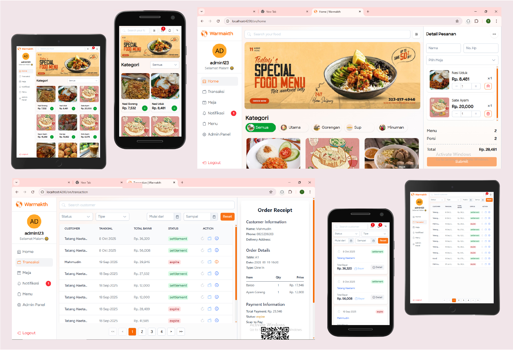
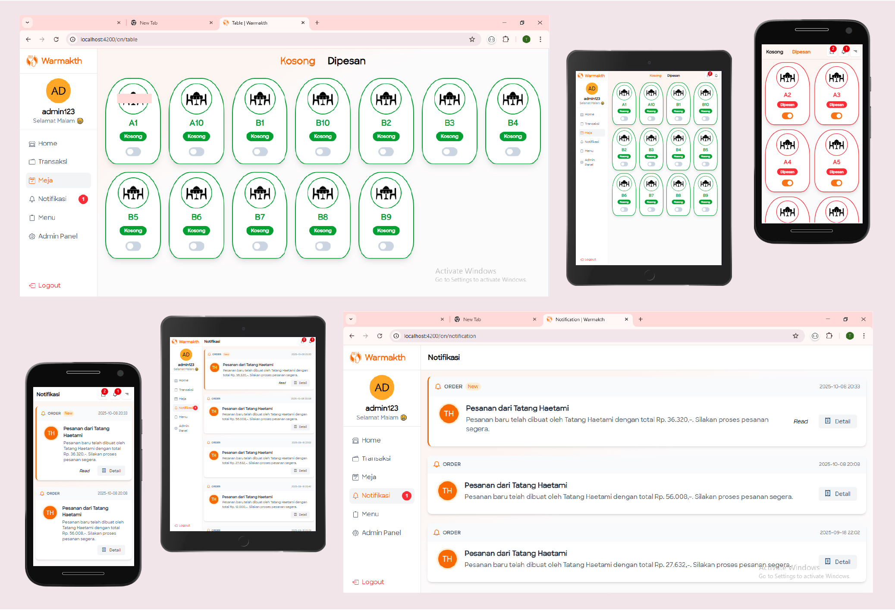
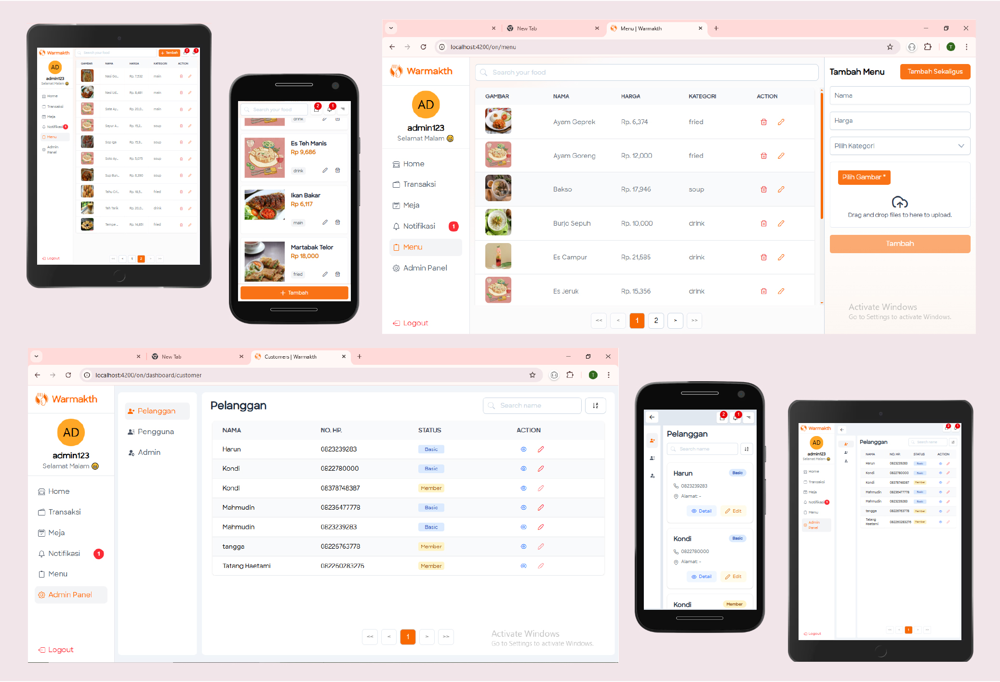
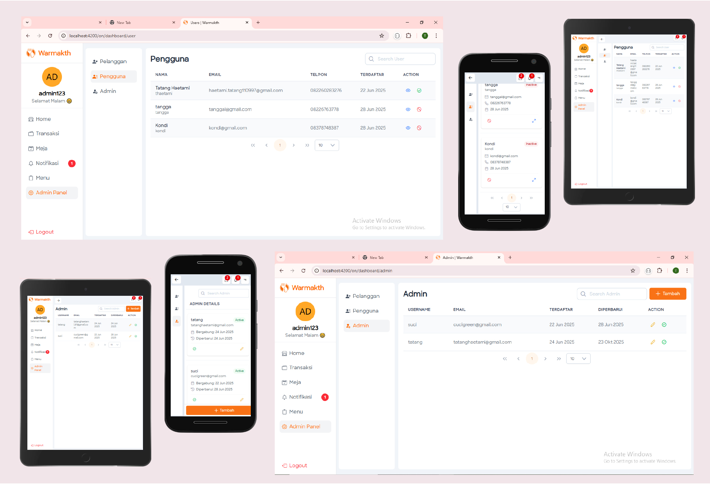
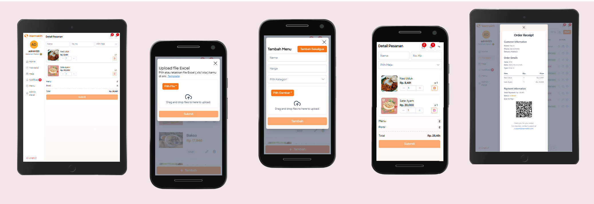

# Warmakth

Angular 19 + SSR (@angular/ssr) + Express application.

This project uses a separate backend REST API built with Kotlin.

Backend repository:
https://github.com/haetamm/kotlin-api/tree/rest-apps

Make sure the backend service is running before starting this application.

---

## Requirements

- Node.js >= 18
- npm >= 9

---

## Installation

Clone repository:

```bash
git clone https://github.com/haetamm/restaurant.git
cd restaurant
```

Install dependencies:

```bash
npm install
```

---

## Environment Configuration

Copy the example environment file:

```bash
cp .env.example .env
```

Then update the values inside `.env` according to your environment.

### Development Example

```env
PRODUCTION=false
BASE_URL=http://localhost:4200
PORT=4200
ALLOWED_ORIGINS=http://localhost:4200
API_BASE_URL=http://localhost:8081/api
GOOGLE_REDIRECT_URI=http://localhost:4200/guest/login
CLIENT_ID=your_google_client_id
GOOGLE_SCOPE="https://www.googleapis.com/auth/userinfo.email https://www.googleapis.com/auth/userinfo.profile openid"
RESPONSE_TYPE=code
ACCESS_TYPE=offline
```

### Production Example

```env
PRODUCTION=true
BASE_URL=https://your-domain.com
PORT=4200
ALLOWED_ORIGINS=https://your-domain.com
API_BASE_URL=https://your-backend-domain.com/api
GOOGLE_REDIRECT_URI=https://your-domain.com/guest/login
CLIENT_ID=your_google_client_id
GOOGLE_SCOPE="https://www.googleapis.com/auth/userinfo.email https://www.googleapis.com/auth/userinfo.profile openid"
RESPONSE_TYPE=code
ACCESS_TYPE=offline
```

### Environment Variables Explanation

- **PRODUCTION**  
  Set `false` for local development, `true` for production deployment.

- **BASE_URL**  
  Public URL where this application is hosted.

  - Development: `http://localhost:4200`
  - Production: `https://your-domain.com`

- **PORT**  
  Port used by the SSR Express server.

- **ALLOWED_ORIGINS**  
  Allowed domains for API access (comma-separated if multiple).

- **API_BASE_URL**  
  Base URL of the external backend API.

- **GOOGLE_REDIRECT_URI**  
  Must match the domain configured in Google OAuth Console.

- **CLIENT_ID**  
  Google OAuth Client ID.

- **GOOGLE_SCOPE**, **RESPONSE_TYPE**, **ACCESS_TYPE**  
  OAuth configuration parameters.

> ⚠ Production values must use the correct public domain and match your OAuth provider configuration.

---

## Development

Run development server:

```bash
npm run dev
```

Application runs at:

```
http://localhost:4200
```

---

## Build

Build the application:

```bash
npm run build
```

---

## Start (Production Mode)

After building:

```bash
npm start
```

---

## Notes

- Do not commit `.env`
- Ensure Google OAuth credentials match your domain
- Ensure external backend API is running

<br>

<div align="center">
  
</div>

<br>

<div align="center">
  
</div>

<br>

<div align="center">
  
</div>

<br>

<div align="center">
  
</div>

<br>

<div align="center">
  
</div>
